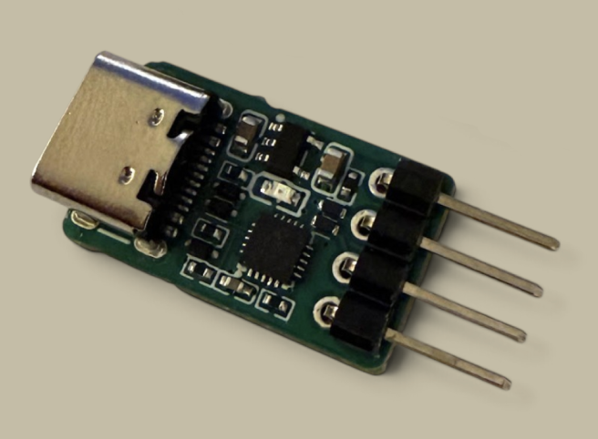

# ch32-tapioca-probe

Two build-time USB debug-probe firmwares for CH32X035:

1. **CMSIS-DAP SWD + JTAG**: an ARM debug probe for OpenOCD and probe-rs.
2. **WCH-Link**: a WCH-LinkE-like probe for CH32 RISC-V, both single-wire **RVSWIO** and two-wire **RVSWD**, driven by stock minichlink or probe-rs. Auto-detects RVSWIO vs RVSWD per target.

The ~€0.25 CH32X035 needs few external parts and fits in a 3 x 3 mm QFN;
its PIOC coprocessor nicely handles the timing-critical single- and two-wire protocols,
making it practical to embed the probe directly into a product.

The project is based on [ch32fun](https://github.com/cnlohr/ch32fun) and reuses
the proven PIOC primitives from the sibling
[Tapioca](https://github.com/pierrejay/ch32-tapioca) project.

A [reference design](hardware/README.md) of a tiny <€5 probe PCB (ARM SWD,
WCH RVSWIO & RVSWD) is also provided with EasyEDA & KiCad source files.



## Tested

| Family | Interface | Chips | Host tools |
|---|---|---|---|
| ARM | SWD (CMSIS-DAP) | STM32H523, STM32G431 | OpenOCD, probe-rs |
| ARM | JTAG (CMSIS-DAP) | STM32H523 | OpenOCD, probe-rs |
| CH32 | RVSWIO (1-wire) | CH32V003, CH32H417 | minichlink, probe-rs |
| CH32 | RVSWD (2-wire) | CH32X035, CH32V203, CH32V307 | minichlink, probe-rs |

## Features

- **Debug transports:** ARM SWD/JTAG and WCH-Link RVSWIO/RVSWD, detailed in the
  two products below.
- **UART bridge:** optional native USB CDC ACM on USART4 (`PB0/TX`, `PB1/RX`),
  exposed as a second USB function, enabled with `make UART_BRIDGE=1` and
  configurable through the host serial port.
- **Target power:** optional load switch controlled through `PA3`; host control is
  currently available with the WCH-Link firmware.
  Switching it off releases the WCH interface and parks UART pins, avoiding
  parasitic powering of the DUT. With a self-powered DUT, `3V3` may remain
  connected; keep target power switched on to retain WCH and UART functionality.
- **Activity LED:** shows the target-power state and blinks during debug or UART
  traffic.

The debug firmwares are host-driven transports: the probe executes the
timing-critical wire transactions, while OpenOCD, probe-rs or minichlink owns
the target-specific flash algorithm.

### Product 1: CMSIS-DAP SWD + JTAG (USB `C251:F000`)

The firmware exposes one **CMSIS-DAP v2** bulk interface for ARM SWD and JTAG
with OpenOCD and probe-rs. `DAP_Connect(0)` selects SWD by default; explicit
`DAP_Connect(1)` and `DAP_Connect(2)` select SWD and JTAG respectively.

#### Pinout

The full firmware pinout supports complete SWJ-DP wiring; the minimal reference
PCB routes only the shared SWD pins:

| Signal | Pin | Notes |
|---|---|---|
| SWD `SWCLK` / JTAG `TCK` | **PC18** (PIOC IO0) | |
| SWD `SWDIO` / JTAG `TMS` | **PC19** (PIOC IO1) | shared SWJ data |
| JTAG `TDI` | PA7 | |
| JTAG `TDO` | PA6 | |
| `nSRST` / SWD `nRESET` | PA4 | optional recovery |
| JTAG `nTRST` | PA5 | optional (needs `JTAG_TRST=1`); otherwise PA5 is free |
| UART `TX` | PB0 | probe to target (needs `UART_BRIDGE=1`) |
| UART `RX` | PB1 | target to probe (needs `UART_BRIDGE=1`) |

#### Notes

- SWD runs a single fixed ~1 MHz profile (`DAP_SWJ_Clock` is accepted for host
  compatibility but doesn't change it). The ARM SWD path is validated for
  correctness, not tuned for speed; its throughput has not been benchmarked
  against a commercial probe.

- JTAG uses a GPIO engine and accepts host clock requests from 1 kHz to 2 MHz.
  Chain discovery, halt/run, reset and SRAM access were validated on STM32H523
  with both OpenOCD and probe-rs, including concurrent UART traffic. Target
  programming was validated with probe-rs at roughly 12 KiB/s. This is modest,
  but still useful for troubleshooting and recovery.

- Select the transport explicitly in the host (`--protocol swd|jtag` with
  probe-rs, or `transport select swd|jtag` with OpenOCD). SWD remains the probe's
  default when the host does not choose. On `DAP_Connect(JTAG)`, the probe emits
  the standard SWD-to-JTAG sequence so hosts such as OpenOCD 0.12 also work when
  another tool left the target in normal SWD. This best-effort transition does
  not wake a target left in the dormant state.

- `probe-rs info --protocol swd` can pause for about ten seconds after finding a
  valid DPv2 target because it deliberately probes two RP2040 multidrop
  addresses. This is a probe-rs discovery quirk, not a Tapioca transport timeout;
  normal target-specific attach and flashing are unaffected.

- Full run-control debugging works with both SWD and JTAG, not just flashing.
  RTT also works over SWD (`OpenOCD rtt` or `defmt`/probe-rs): it uses ordinary
  target-memory access and needs no trace pin.

- There is no SWO/ITM trace yet (no `DAP_SWO_*` commands), so `printf`-over-SWO and
  instruction trace aren't available.

- The CMSIS-DAP SWD and JTAG paths exercised by OpenOCD and probe-rs are
  implemented. Transfer value matching and the optional SWJ pin-wait behavior
  are not; unsupported features are not advertised as probe capabilities.

- Example OpenOCD configs for driving targets through the probe are in
  [`openocd/`](openocd/), including the validated STM32H523 JTAG chain.

### Product 2: WCH-Link, RVSWIO & RVSWD (USB `1a86:8010`)

A WCH-LinkE-compatible probe for CH32 RISC-V, driven by **stock minichlink** or
**probe-rs 0.32+** where its target support is available.

The probe implements the WCH-Link *direct-DMI* passthrough only: the **host owns the flash algorithm**, the probe just runs the wire transactions. That is simple and enough for most flashing (which is why `minichlink` drives it), but it is not a full WCH-LinkE: tools that rely on the flash-programming logic built into a real probe are untested and likely won't work as-is.

probe-rs works through this direct-DMI path and has been exercised on all targets
listed above. Support still depends on the target definitions and flash algorithms
available upstream, so less mature targets may retain host-side quirks; for example,
regular H417 flashing works, while full-chip erase awaits an upstream flash-algorithm
fix.

- **RVSWIO**: single-wire, for the small parts (CH32V003…).
- **RVSWD**: two-wire, for the larger parts (CH32V307, CH32V203, CH32X035…).
- **Auto-detection**: one firmware probes the target and picks the transport itself, so the same binary flashes a CH32V003 and a CH32V307 with no reflash.

#### Pinout

One data line, plus a clock for the 2-wire parts:

| Signal | Pin | Notes |
|---|---|---|
| `SWCLK` | **PC18** (PIOC IO0) | 2-wire only |
| `SWDIO` / `SWIO` | **PC19** (PIOC IO1) | data (1- & 2-wire) |
| UART `TX` | PB0 | probe to target (needs `UART_BRIDGE=1`) |
| UART `RX` | PB1 | target to probe (needs `UART_BRIDGE=1`) |
| `PWREN` | PA3 | target 3.3V load switch (optional, defaults on) |

#### Notes

- Some MCUs (e.g. CH32V003 1-wire and CH32X035 2-wire) drive SWDIO
  open-drain and need an external **~4.7–10 kΩ pull-up** to 3.3 V. Others (like
  CH32V203/V307) work without one. The reference board uses a 5.1 kΩ pull-up, which
  makes it universal.

- On the same direct-DMI `minichlink` it flashes ~15 % faster than a genuine WCH-LinkE
  R0-1v3 and reads ~30 % faster (CH32V203, 32 KB payload). Insignificant in practice, and not directly comparable with vendor algorithms (e.g. using wlink), but a good sign that the PIOC approach holds up. There is still plenty of headroom to optimise the USB link and flashing process.

- Some older `minichlink` builds don't drive direct-DMI. `make minichlink` builds
  the pinned version directly from the ch32fun submodule.

- Target power is controlled with `minichlink -k3 -C linke` (on) and
  `minichlink -kt -C linke` (off). The `-k` avoids probing an intentionally
  unpowered target before applying the command. Power control is not yet exposed
  by the CMSIS-DAP firmware.

## Build & flash

Clone the SDK submodule and build both products with a WCH-capable GNU RISC-V
embedded toolchain supporting `rv32imacxw` (`riscv-none-embed`,
`riscv-wch-elf`, `riscv-none-elf`, or another compatible prefix):

```sh
git submodule update --init
make
```

The Makefile uses an explicit `RISCV_PREFIX` first, then a toolchain installed
in `sdk/toolchain/`, then a compatible toolchain from `PATH`. For example, the
PlatformIO-distributed GCC 8.2.0 used to validate this project can be installed
directly in the repository without installing PlatformIO itself:

```sh
# macOS
git clone --depth 1 --branch 8.2.0 \
  https://github.com/Community-PIO-CH32V/toolchain-riscv-mac.git sdk/toolchain

# Linux x86_64, including WSL2
git clone --depth 1 --branch 8.2.0 \
  https://github.com/Community-PIO-CH32V/toolchain-riscv-linux.git sdk/toolchain
```

If the compiler has a different prefix,
pass it explicitly, for example `make RISCV_PREFIX=riscv64-unknown-elf`.

Both products flash through the CH32X035 USB ISP bootloader with
[`wchisp`](https://github.com/ch32-rs/wchisp) (hold `BOOT` while plugging in):

```sh
make flash-jtagswd   # product 1: ARM SWD/JTAG (CMSIS-DAP v2)
make flash-wchlink   # product 2: WCH-Link (auto RVSWIO/RVSWD)
```

Firmware options and the product to flash can be selected in the same command,
for example `make UART_BRIDGE=1 JTAG_TRST=1 flash-jtagswd`.
`make help` lists every supported build option and tool override.

On Linux, install the included udev rules once to access the CH32X035 ROM USB
ISP bootloader and the CMSIS-DAP development identity without `sudo` (the user
must belong to the `plugdev` group):

```sh
sudo install -m 0644 udev/50-ch32-tapioca-probe.rules /etc/udev/rules.d/
sudo udevadm control --reload-rules
```

Unplug and reconnect the probe after installing the rules.

Run the native unit tests with `make test`. See `make help` for the common
targets. PC18/PC19 are the CH32X035's own SDI debug pins, so the probe itself is
flashed over USB ISP, not SWD.

## USB identity: disclaimer

The CMSIS-DAP firmware temporarily borrows `C251:F000`, the Keil/Arm identity
used by the [CMSIS-DAP v2 example configuration](https://arm-software.github.io/CMSIS_5/DAP/html/group__DAP__ConfigUSB__gr.html).
It is not allocated to this project; CMSIS-DAP hosts identify the interface
through its `CMSIS-DAP v2` string rather than a project-specific PID.

The WCH-Link firmware still borrows WCH-LinkE's `1a86:8010` identity so stock
minichlink can discover it. This is not an official WCH, Keil or Arm product.

A dedicated [pid.codes](https://pid.codes) allocation is planned. Replace these
development identities before distributing anything built on this.

## Credits

- [**CMSIS-DAP**](https://github.com/ARM-software/CMSIS-DAP) / Arm
- [**ch32fun & minichlink**](https://github.com/cnlohr/ch32fun) / Charles Lohr

See [`THIRD_PARTY.md`](THIRD_PARTY.md) for detailed contributions.
