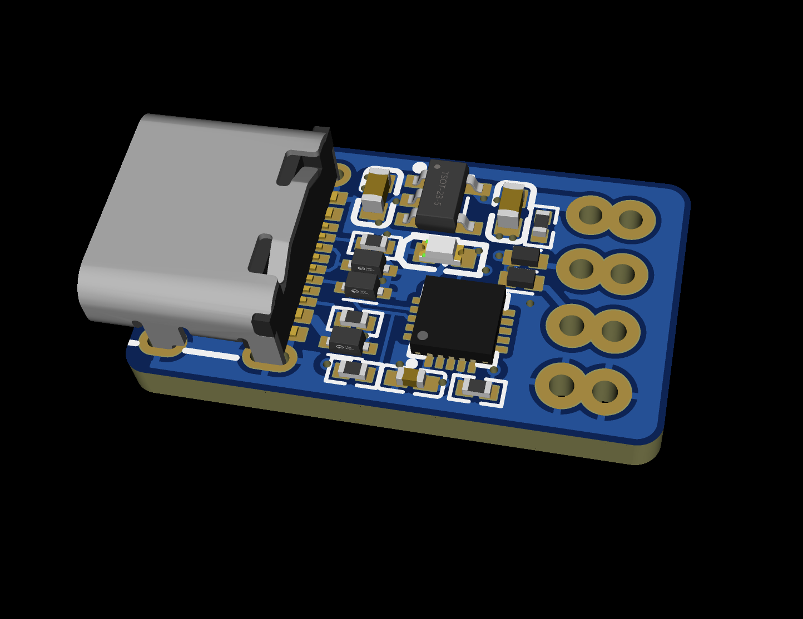
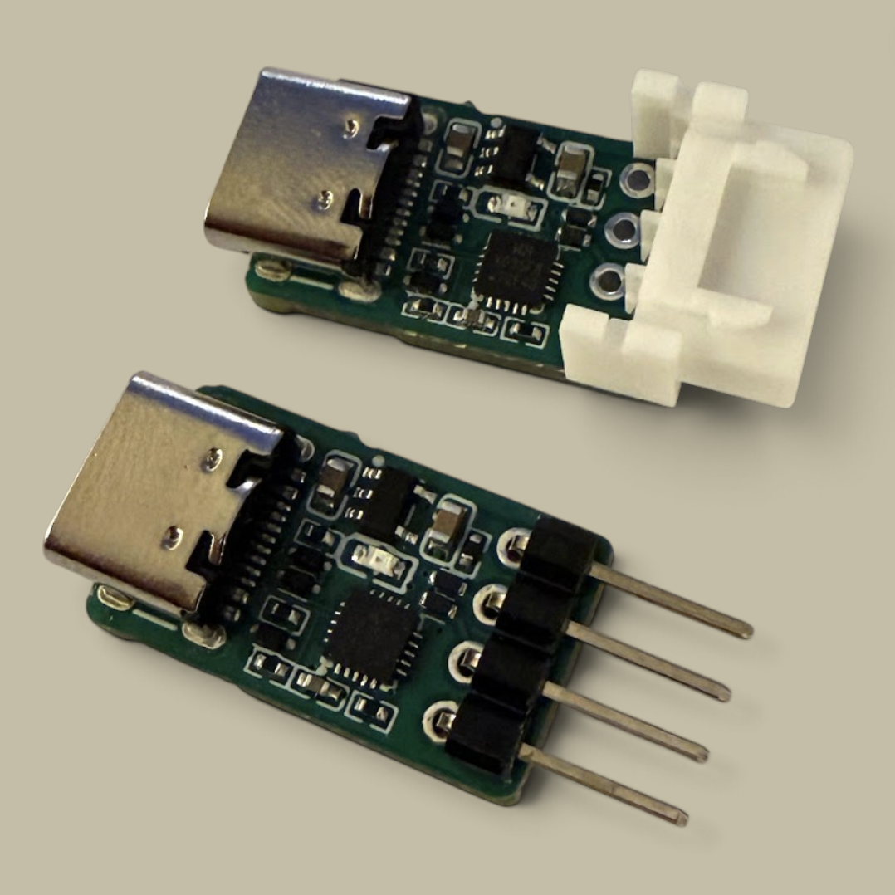
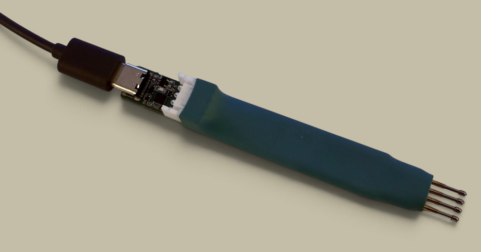
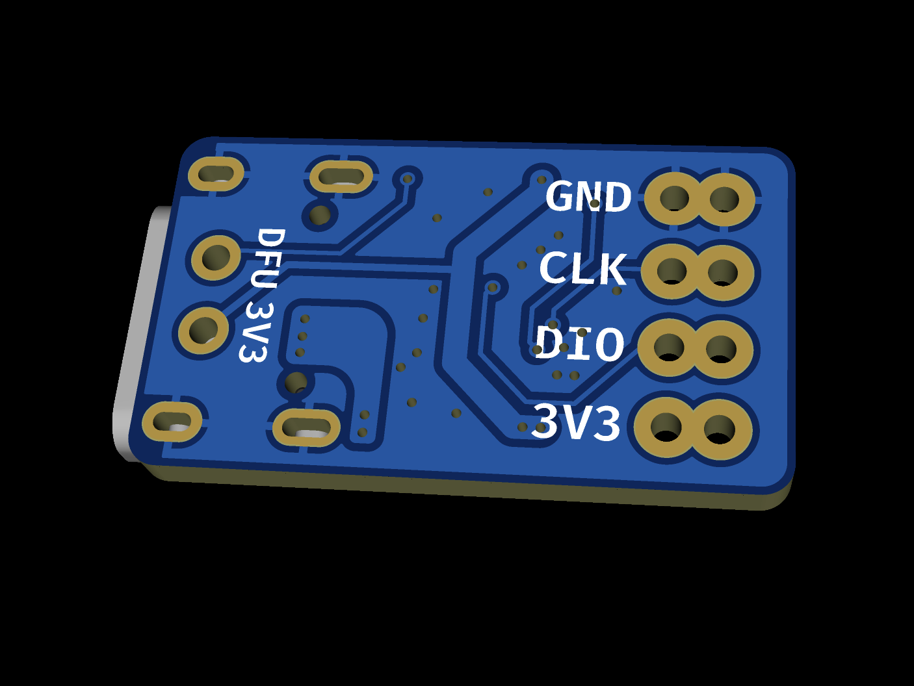

# Reference hardware

This directory contains a compact reference implementation of CH32X035 Tapioca Probe.
It is designed as a practical, inexpensive board that can be plugged directly into
a USB-C host and connected to an ARM or WCH RISC-V target with only four signals.

Fabrication files (Gerber, BOM, CPL) can be trivially generated from the EasyEDA Pro
& KiCad source files provided here.

## Board overview

- Dimensions: 11.5 x 20 mm;
- 4-layer PCB with 2 inner ground planes;
- CH32X035F8U6 in a 3 x 3 mm QFN package;
- USB-C receptacle;
- on-board 3.3 V regulator;
- reverse-current-protected 500 mA switched 3.3 V target output;
- activity LED on `PA2`;
- 5.1 kOhm pull-up from `DIO` to the switched target rail;
- ESD protection on the USB and target-facing debug lines;
- two alternative through-hole target-connector footprints.

The four-pin connector exposes the signals shared by ARM SWD and the WCH
single-/two-wire transports. The firmware also implements four-wire JTAG, but this
minimal PCB does not route `TDI`, `TDO`, `nSRST` or `nTRST`.

Turnkey PCBA cost is around €20 for a series of 5 boards (shipping excluded)
using JLCPCB economic assembly. Reference stackup is `JLC04161H-3313` but
the default one works fine and avoids Standard assembly surcharge.

## Target connector

The 2 rows of pins allow to fit different kinds of connectors like:

- A conventional **male or female 2.54 mm header**. Male header
can plug temporarily into staggered through-holes on the target PCB,
providing enough friction for short programming or test sessions
without fitting a connector to the target. The probe can equally be
used with ordinary Dupont leads or a conventional target-side pin header.

- A shrouded **04JQ-ST B2B plug** compatible with the JST-XH-style 2.50 mm
connection commonly found on inexpensive pogo-pin test probes.
It can also feed a small adapter board for Tag-Connect, SKEDD or a project-specific
target connector.

### Pinout

| Pin | Signal | Function |
|---:|---|---|
| 1 | `GND` | Common ground |
| 2 | `CLK` | ARM `SWCLK` / WCH RVSWD clock |
| 3 | `DIO` | ARM `SWDIO` / WCH `SWDIO` or `SWIO` |
| 4 | `3V3` | Switched 3.3 V output from the probe |

The order is also printed on the bottom silkscreen:

## Target power

USB VBUS feeds an on-board **RT9080-33GJ5** regulator. Its 3.3 V output powers the
probe and reaches pin 4 through a reverse-current-protected load switch, so the
probe can also power a small target. The 500 mA switch is enabled by default
through an external pull-up.

Leave target power enabled for normal use, including with a self-powered target:
the load switch prevents current flowing back into the probe whether or not pin 4
is connected. Disable it only when the target must be fully isolated. The UART
pins are then parked, and the 5.1 kOhm DIO pull-up loses power with the switched
target rail.

The 500 mA switch rating is an upper bound, not a guaranteed target-current
budget: probe consumption, regulator dissipation and the thermal limits of this
small PCB must also be considered.

## Entering boot mode

The PIOC occupies the CH32X035 debug pins, so this board uses two exposed
pads on the bottom side for boot mode selection.

Normally, USB bootloader is already enabled out of fab, so firmware can be uploaded
straight away without shorting DFU pads. To enter the CH32 USB bootloader again:

1. Disconnect the board from USB.
2. Short the pads marked **DFU** and **3V3** under the USB-C connector with tweezers
   or a small jumper (beware not to short 3V3 with the USB connector shell on the other side!)
3. Plug the board into USB while keeping the pads shorted (LED should turn on).
4. Remove the short and flash with main README's [instructions](../README.md#build--flash).
