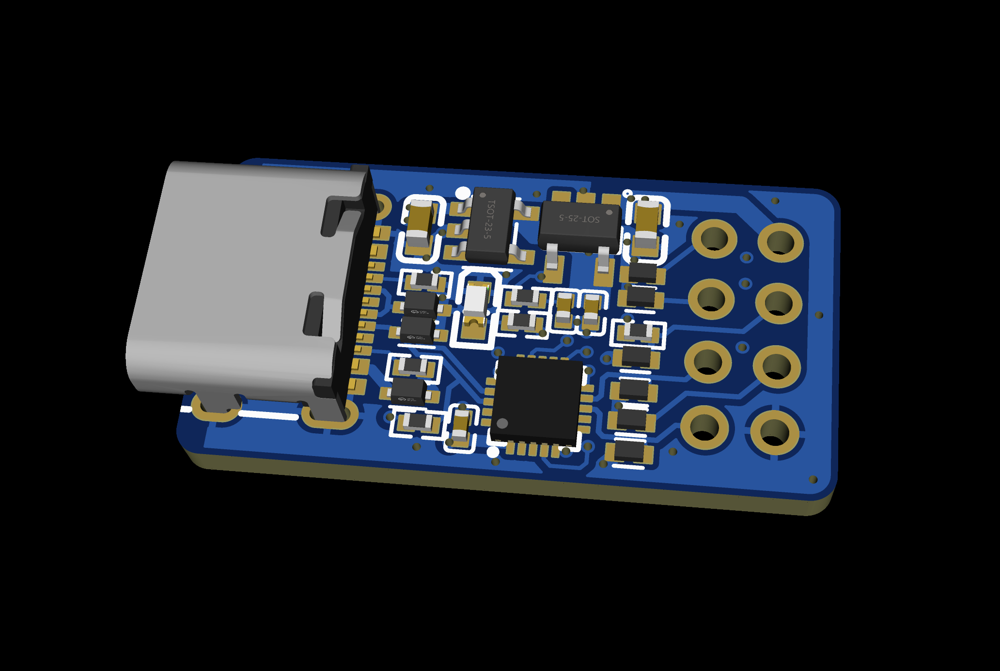
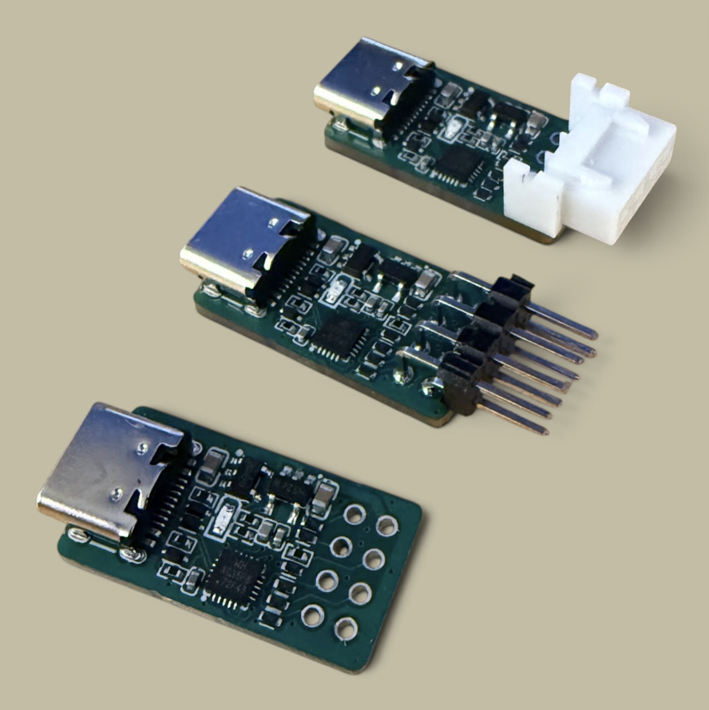
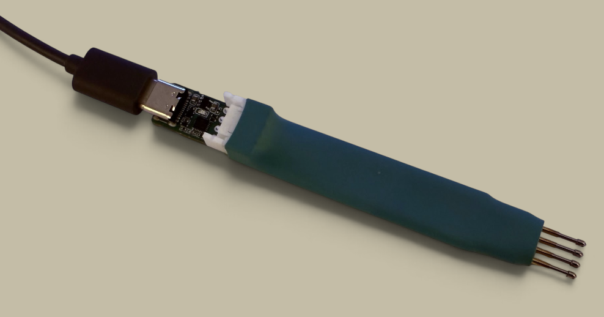
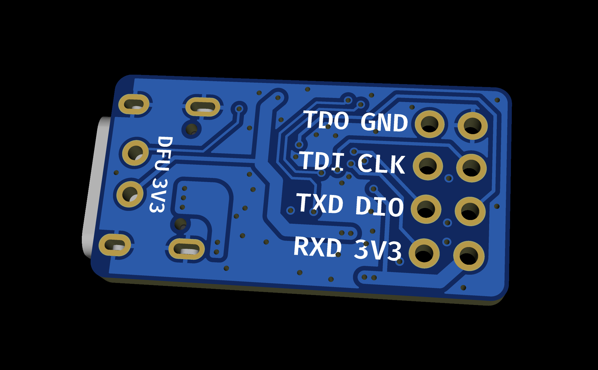

# Reference hardware

This directory contains the reference hardware for Tapioca Probe Mini, a compact
CH32X035-based debug probe designed to plug directly into a USB-C host. It exposes
ARM SWD, JTAG and WCH RISC-V debug pins, a USB-to-UART bridge and software-controlled
3.3 V target power in a 12.5 x 23.5 mm form factor.

Fabrication files (Gerber, BOM and CPL) can be generated from the provided
EasyEDA Pro or KiCad source files.



## Board overview

- 12.5 x 23.5 mm, 4-layer PCB;
- CH32X035F8U6 in a 3 x 3 mm QFN package;
- USB-C receptacle;
- on-board RT9080-33GJ5 3.3 V regulator;
- AP2151WG-7 protected 500 mA target-power load switch, enabled by default;
- USB CDC ACM UART bridge on `PB0/TX` and `PB1/RX`;
- ARM SWD, JTAG and WCH RVSWIO/RVSWD connections;
- activity LED on `PA2`;
- switched 5.1 kOhm pull-up on `DIO`;
- ESD protection on USB and all target-facing signal lines.

Turnkey PCBA cost is around €30 for a one-shot series of five boards (shipping
excluded) using JLCPCB economic assembly. It uses the default 4-layer `7628` stackup,
compatible with economic PCBA service.

## Pinout



The board exposes eight signals on two rows of 2.54 mm through-holes. Their
layout accepts several connector options, for instance:

- conventional male or female 2.54 mm headers;
- a shrouded 04JQ-ST board-to-board plug on the four main debug signals,
  compatible with the JST-XH-style 2.50 mm connection found on inexpensive
  pogo-pin test probes, or with a small adapter board for Tag-Connect, SKEDD or
  another target connector.



The pin numbering follows the physical arrangement of the connector:

| | Signal | Signal | |
|---:|---|---|---:|
| 8 | `RXD` | `3V3` | 7 |
| 6 | `TXD` | `DIO/TMS` | 5 |
| 4 | `TDI` | `CLK/TCK` | 3 |
| 2 | `TDO` | `GND` | 1 |

For JTAG, there are no dedicated `nTRST` or `nRESET` pins;
JTAG reset uses the standard software-driven TMS sequence.

The connector labels are also printed on the bottom silkscreen:



## Target power

USB VBUS feeds the on-board RT9080-33GJ5 regulator. The probe's 3.3 V rail then
feeds the target connector through an AP2151WG-7 high-side load switch rated for
500 mA continuous current, with current limiting, short-circuit and thermal
protection.

The load switch is pulled on by default, so a target is powered immediately when
the probe starts. Firmware can switch it off when a complete DUT power cycle or
isolation is required.

In the off state, the UART pins are parked and the `DIO` pull-up is disconnected
with the target rail to prevent parasitic powering.

When the DUT has its own supply, the `3V3` connection may remain attached because
the load switch protects the probe from reverse current. Keep target power
enabled to retain the UART bridge active.

The 500 mA rating is the load-switch limit, not an unconditional target-current
budget. Available current also depends on the probe's own consumption, regulator
dissipation and the thermal limits of this small PCB.

## Entering boot mode

The PIOC occupies the CH32X035 debug pins, so the board provides two exposed pads
on the bottom side for boot-mode selection.

The USB bootloader is normally enabled at the factory, so the first upload
can be done without shorting these pads. To enter it again:

1. Disconnect the board from USB.
2. Short the pads marked **DFU** and **3V3** under the USB-C connector with
   tweezers or a small jumper. Avoid touching the USB connector shell.
3. Plug the board into USB while keeping the pads shorted; the LED should turn on.
4. Remove the short and follow the main README's
   [flashing instructions](../README.md#build--flash).

Flash commands:

```sh
make UART_BRIDGE=1 flash-wchlink # WCH RVSWIO & RVSWD
make UART_BRIDGE=1 flash-jtagswd # ARM SWD & JTAG
```
